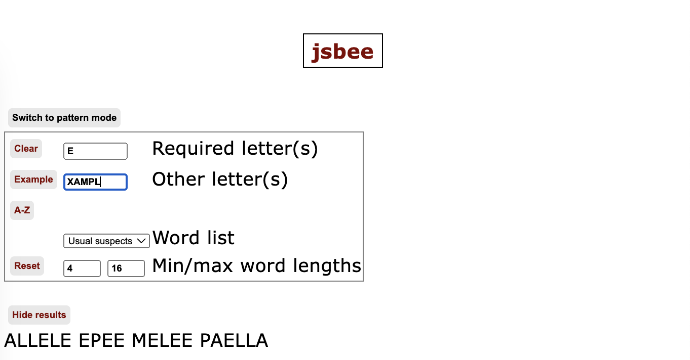

# jsbee

This is a quick little JavaScript app for (last-hope-desperation!!) peeking into anagram and constrained-anagram puzzles including the NYT Spelling Bee.

It was a fun little DIY JavaScript project at the end of 2024.

## Philosophy

This is a word-list app -- a tool of last resort for the NYT Spelling Bee, and other things as well. Here is my own approach:

* First: I start with the day's letters, of course.
* Second: I generally get around half the words before looking at the Grid. I consider this effectively a part of the game itself.
* Also second: The Buddy's Grid and Two-Letter List portions have all the same information as the Grid, while removing the need for scratch paper.
* Third, the Stats: these aren't hints by any means, but, they help me prioritize: if I'm missing, say, a six-letter word starting with a P, then if 80% of readers have found it, I do know the word, and I just need to search. But if only 20% of readers have found it, in my experience, that's a word I do _not_ know (yet).
* My partner and I have developed a list of the "usual suspects" -- words that seem to appear only in the Spelling Bee, including _aril_, _natant_, _tilth_, and _tinct_. These are encoded in the JSBee app. The usual-suspects list also includes our oh-I-cannot-believe-I-keep-forgetting that words.
* I try to complete the puzzle using these four. About half the time, I can Queen Bee on this basis: without hints.
* Fifth: the reader hints. On those days I've got a few words left, I end up taking 1, 2, 3, 5 hints; worst case, 10 or so. And looking at a hint almost always results in success.
* Sixth: even with reader hints there is occasionally a stumper. This rarely happens for me -- less than one day in ten -- in large part due to the quality of the reader hints.  The fork in the road is to shrug and say _I don't know what this word is_, and call it a loss for the day -- or, to find a way to learn what may be a new word.  Here is where word lists come into play -- and JSBee is a word-list app designed for that purpose.

## Features

Bee mode:

* Enter required and other letters. (For the NYT Spelling Bee, there is one of the former and six of the latter.)
* Choose the word list from the dropdown:
  * "Usual suspects" is a short, curated list of once-bitten-twice-shy values from previous Bees.
  * "Long list" is a long list (almost 200K words), not all of which are in the NYT Spelling Bee. That is, this can show words that the NYT Spelling Bee doesn't accept.
* The output shown will include all words from the selected word list which contain only your required letters and your other letters. If those are `E` and `XAMPLS` then all the words shown will contain only some subset of the letters `EXAMPLS`, and additionally they'll have the letter `E`.
  * If the required letter is `P` and the other letters are `AELM`, then you'll see `PALM` and `PALE` but not `MEAL`.
  * If the required letter is `M` and the other letters are `AELP`, then you'll see `MALL` and `MEAL` but not `PALE`.
* Variations:
  * If you enter letters only in the required-letters field, you get more of an anagram-finder.
  * If you enter letters only in the other-letters field, you get more of a word-finder.

Pattern mode:

* Enter letters, along with `.` or `*`. The `.` will match any letter in one position; `*` will match any number of letters.
* Examples:
  * `A..E` shows `ABLE`, `ACHE`, etc.
  * `*ETH` shows all words ending in `ETH`
  * `THEA*` shows all words starting with `THEA`
  * `TH*ST` shows all words starting with `TH` and ending with `ST`.

## Hosted app

[https://johnkerl.org/jsbee](https://johnkerl.org/jsbee).

## JavaScript tooling

This app uses the [Sliver JavaScript library](https://github.com/johnkerl/sliver).

## Examples

Bee mode: specify one required or "center" letter, and others, using the short list:

Search in the long list:

Constrain the word length:

Make all letters required -- this means any match must include _all_ of the letters:

Make all letters non-required -- this means any match must include _any subset_ of the letters:

Pattern mode:

